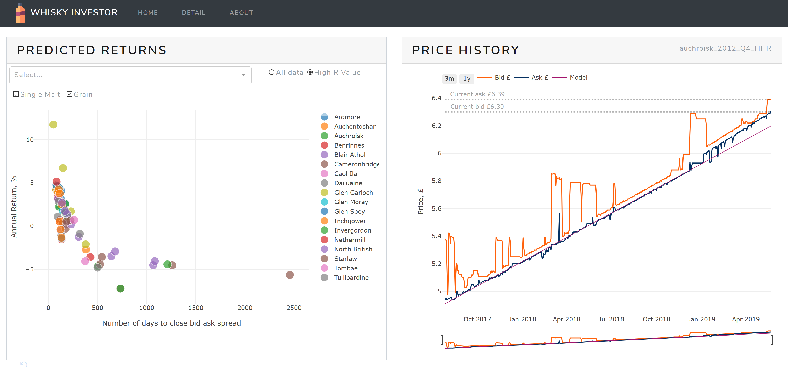
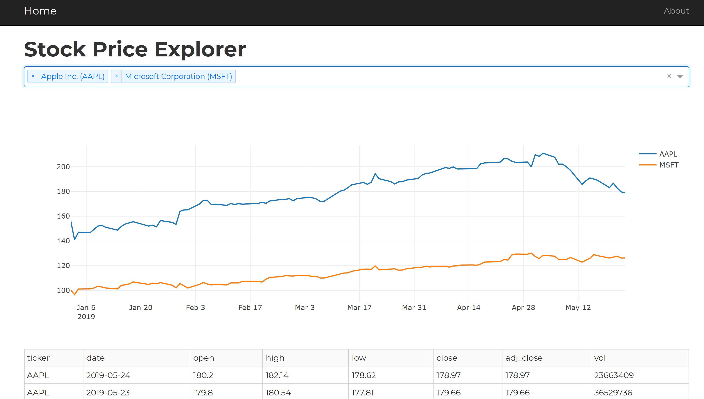

## About Me
I enjoy data, cycling, and whisky. The following are some personal projects that loosely follow those themes.

## Whisky Investor | [link](https://whisky-invest.herokuapp.com/)  
  
Dashboard to support investing in Scotch Whisky on [WhiskyInvestDirect.com](whiskyinvestdirect.com). Shows the top current investment opportunities, and a detailed pricing analysis.

#### Technology and features:
- Pricing data scraped using Python (beautifulsoup and regex)
- Daily script deployed on AWS to scrape, process, and model data
- Linear regression and trading cost modelling to predict earnings for each whisky
- Stores daily historic data in an AWS S3 bucket
- Multi page dashboard deployed on Heroku, built using Flask, and [Dash by Plot.ly](https://dash.plot.ly/getting-started)
- Themed using Bootstrap
- Dynamic cross-filtering of charts

## Bike Counter Dashboard | [link](https://app.powerbi.com/view?r=eyJrIjoiNGQyMzYzMTQtOTQzMi00ZDc2LWEzYTktNTlmYmFiMmExMDE4IiwidCI6ImExMDc1MmQ2LTI4NjEtNDEwMy1iNmM4LTg4YTUxMjAxOTI4MiIsImMiOjJ9)  
<iframe width="700" height="400" src="https://app.powerbi.com/view?r=eyJrIjoiNGQyMzYzMTQtOTQzMi00ZDc2LWEzYTktNTlmYmFiMmExMDE4IiwidCI6ImExMDc1MmQ2LTI4NjEtNDEwMy1iNmM4LTg4YTUxMjAxOTI4MiIsImMiOjJ9" frameborder="0"> </iframe>  
Daily bike counter data displayed on a web dashboard deployed using [PowerBI](https://powerbi.microsoft.com/en-us/), using public [OData](https://en.wikipedia.org/wiki/Open_Data_Protocol) feed updated monthly.

#### Technology and features:
- Importing web data using [PowerBI](https://powerbi.microsoft.com/en-us/) and OData feed ([source](https://data.seattle.gov/Transportation/Burke-Gilman-Trail-north-of-NE-70th-St-Bike-and-Pe/2z5v-ecg8))
- Data aggregated by day and hour to show peak activity and trends
- Custom columns and DAX measures to calculate month on month percentage change, reactive to filtered month

## Stock Price Explorer | [link](https://dash-ticker.herokuapp.com/)
  
Web App project to display stock ticker information via [Dash by Plot.ly](https://dash.plot.ly/getting-started).

#### Technology and features:
- Retrieves historic stock price using the [AlphaVantage API](https://www.alphavantage.co/) using Python requests library
- Single page dashboard deployed on Heroku, built using Flask, and [Dash by Plot.ly](https://dash.plot.ly/getting-started)
- Search for stocks via search box with autocomplete
- Caching with expiry to Redis cache on Heroku to reduce the number of API calls (and stay within the 5 calls per minute API restriction)
- Display multiple stocks in chart
- Dynamically updating table of stock prices

## Stock Price Modelling Using LinkedIn Dataset | [link](https://github.com/arms3/Jobs-Stock-Price_Prediction)
Series of Python Jupyter notebooks exploring the relationship between stock prices and LinkedIn employee count data, with the goal of either predicting changes in stock price using employee data or finding an indicator of future hiring patterns or layoffs based on the stock price.

The notebooks attempt to predict future pricing using linear modelling techniques [scikit-learn](https://scikit-learn.org/stable/), and non-linear models using [PyTorch](https://pytorch.org/), however no evidence of improvement over a naïve model (using the previous day value to predict the stock price) was found. The evidence from lagged cross correlation was also inconclusive, and due to the large number of stocks used many of the correlations found may have been spurious.
#### Notbooks:
1. Data load and EDA | [link](https://nbviewer.jupyter.org/github/arms3/Jobs-Stock-Price_Prediction/blob/master/Data%20Load%20and%20EDA.ipynb) | Loading and viewing datasets, exploring time lagged cross correlation between stock price and number of employees listed on LinkedIn
2. Linear modelling | [link](https://github.com/arms3/Jobs-Stock-Price_Prediction/blob/master/Modelling.ipynb) | Comparison of linear model prediction accuracy with and without LinkedIn dataset
3. Neural Network modelling | [link](https://github.com/arms3/Jobs-Stock-Price_Prediction/blob/master/Modelling%20Neural%20Network.ipynb) | Experiments using a convolutional neural network model based on Google's WaveNet architecture to predict stock price
